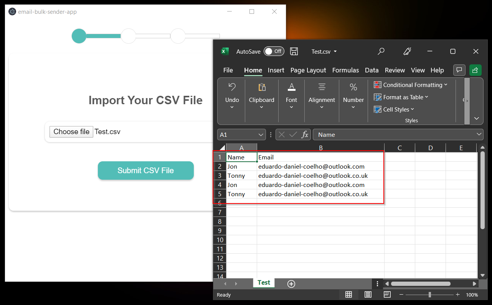
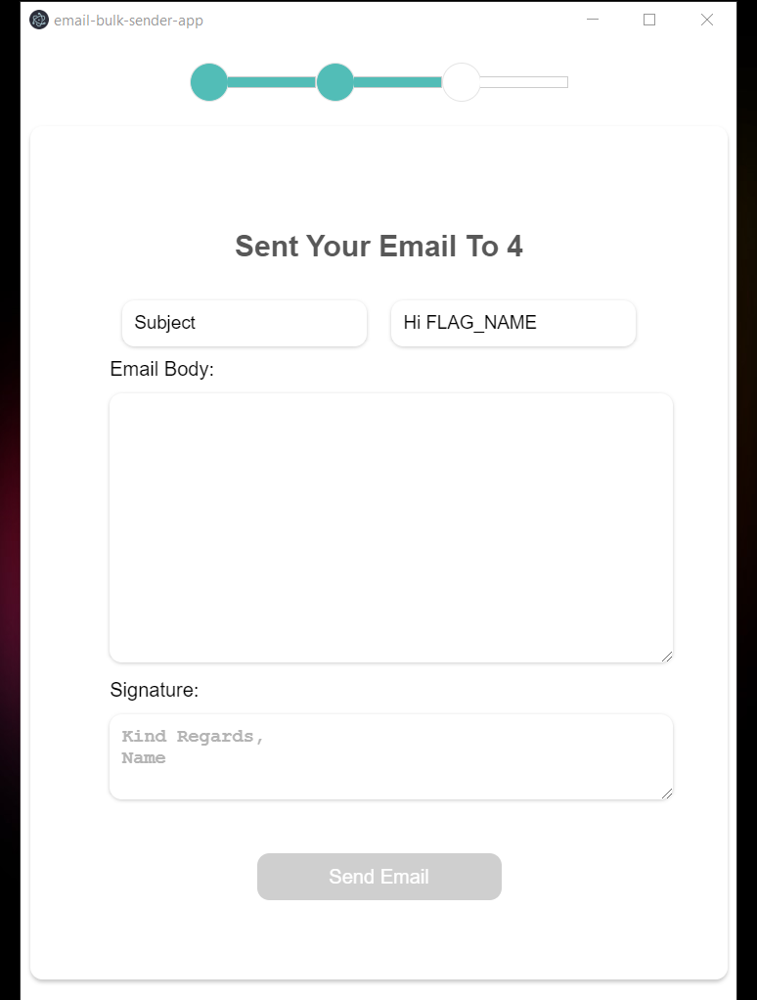

<h1 align="center">Email Bulk Sender</h1>

# Project Description

The Email Bulk Sender is a simple electron app that enables you to send emails in bulk, to a given list of recipients loaded by a CSV.

I came up with this idea after speaking to one of my friends about sending emails in bulk. He is a contractor and through our conversation he told me that when his contract is about to run out he normally goes through a list of contacts and emails them manually, so I came up with the idea of building an app that would automate this. 

Built With
- React 
- TypeScript
- Styled Components
- Node
- Nodemailer
- NPM
- Electron

## How it works

- Add your email and password, those details will not be saved locally or remotely - the user data only exists has an instance in the react state and will clear after you send the email or if you close the app, refresh etc.

- Add the CSV file that contains a list of contacts - it's important that the CSV file is formatted the same way as on the screenshot with a name an email Heather. please note that I haven't added any validation for CSV Injection as it is not needed for this project.

- Then finally write an email that you want to send to your list of contacts - if you want to change the greeting from hi to good morning or anything else don't forget to add the FLAG_NAME that is going to be replaced by the name of the contact.

## Available Commands

In the project directory, you can run:

Run the command below first to build the app.
### `npm run build`

After successfully building the app you can run the below command to run the app locally.
### `npm run dev`

To package the app into an executable, run the command below but make sure that you run npm run build first before doing this.
### `npm run pack`

## 🤝 Support

Contributions, issues, and feature requests are welcome!

Give a ⭐️ if you like this project!
